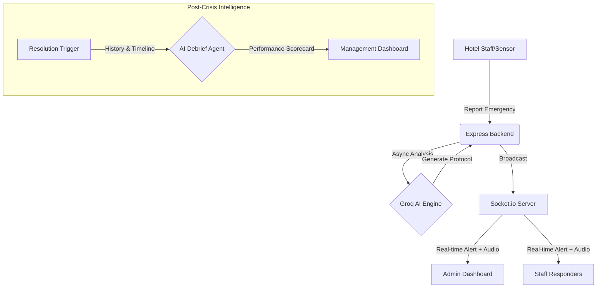

    # 🛡️ CrisisConnect: Cinematic Emergency Intelligence

**CrisisConnect** is a high-performance, AI-driven emergency dispatch and management platform specifically engineered for the luxury hospitality and hotel industry. It replaces fragmented communication with a unified, "Cinematic High-Performance" command center that ensures every second counts when safety is on the line.

---

## 🏗️ System Architecture



---

## 🚀 The Elite Tech Stack

### Frontend: Cinematic UI
- **React (Vite)**: Lightning-fast frontend development and Hot Module Replacement.
- **Tailwind CSS**: Custom "Pure Dark" theme with Fire Orange (#F45B20) accents.
- **3D Perspective Engine**: Advanced CSS transforms for interactive hero mockups.
- **Lucide Icons**: High-fidelity SVG icons for critical UI markers.
- **Recharts**: Data visualization for live crisis analytics.

### Backend: Real-time Dispatch
- **Node.js & Express**: High-concurrency event handling.
- **Socket.io**: Bi-directional, sub-100ms communication for global alerts.
- **MongoDB Atlas**: Cloud-native document storage with global clustering.
- **JWT & Bcrypt**: Enterprise-grade authentication and secure session management.

### AI Engine: Groq Llama 3
- **Groq API**: Leveraging LPU (Language Processing Unit) technology for near-instant inference speed.
- **Llama 3.3 70B**: Utilized for complex protocol synthesis and post-mortem performance auditing.

---

## ✨ Premium Features

### 🎞️ Cinematic High-Performance UI
A dark-mode, premium interface designed to "WOW" at first glance. Features 3D phone mockups, floating UI badges, and a 0.03 opacity fractal grain texture for an elite software feel.

### 🤖 AI Protocol Engine
Automatically transforms a simple crisis description into a 5-step interactive protocol, suggesting the exact departments required for intervention.

### 📝 AI Post-Mortem (Management Scorecard)
Once a crisis is resolved, the AI analyzes the entire timeline and generates an efficiency grade (A-F), performance metrics, and a "Dispatch Analysis" for management review.

### 🔊 Sub-Second Audio Alerts
Global WebSocket synchronization ensures that when a fire or medical alert is raised, an audible ping sounds on every responder's device instantly.

### 🗺️ Floor-Mapped Protocols
Context-aware response steps that adjust based on the specific hotel floor and area reported.

---

## 🛠️ Installation & Setup

### Prerequisites
- Node.js (v18+)
- MongoDB Atlas Account
- Groq API Key

### 1. Clone & Install
```bash
git clone https://github.com/yourusername/CrisisConnect.git
cd CrisisConnect

# Install Backend
cd server && npm install

# Install Frontend
cd ../client && npm install
```

### 2. Configuration
Create a `.env` file in the `server` directory:
```env
PORT=5000
MONGO_URI=your_mongodb_atlas_uri
JWT_SECRET=your_super_secret_key
GROK_API_KEY=your_gsk_api_key
CLIENT_URL=http://localhost:5173
```

### 3. Start the Engines
```bash
# Run Backend (from /server)
npm run dev

# Run Frontend (from /client)
npm run dev
```

---

## 👨‍💻 Author
**CrisisConnect Team** - *Redefining Safety for Modern Hospitality.*
